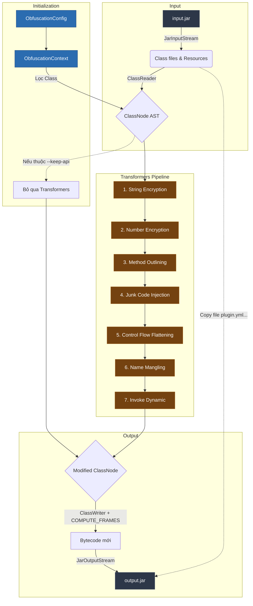

# ElainaShield - Cấu trúc dự án & Nguyên lý hoạt động 🧙‍♀️✨

Tài liệu này giải thích chi tiết về kiến trúc mã nguồn và luồng thực thi (pipeline) của Obfuscator **ElainaShield**. Tool này hoạt động dựa trên thư viện phân tích bytecode **ASM** (cụ thể là ASM Tree API).

---

## 1. Cấu trúc thư mục (Project Structure)

Mã nguồn được chia thành các module rõ ràng:

```text
src/main/java/com/elainashield/obfuscator/
├── ElainaShield.java                 # Điểm Entry point (hàm main). Xử lý tham số dòng lệnh (CLI).
├── core/                             # Lõi quản lý tiến trình
│   ├── JarProcessor.java             # Trái tim của tool. Quản lý toàn bộ Pipeline từ lúc đọc JAR đến ghi JAR.
│   ├── ObfuscationConfig.java        # Lưu trữ cấu hình người dùng (--keep-api, --aggressive, ...).
│   ├── ObfuscationContext.java       # Lưu trữ ngữ cảnh toàn cục (Scope, Map đổi tên, Danh sách Exclude).
│   ├── DependenciesLoader.java       # ClassLoader ảo để load thư viện (--libraries) cho ClassWriter.
│   └── CustomClassWriter.java        # Ghi đè ClassWriter của ASM để hỗ trợ tính toán StackMapFrame.
├── transformers/                     # Các module làm rối mã (Chạy theo thứ tự nghiêm ngặt)
│   ├── StringEncryptionTransformer.java
│   ├── NumberEncryptionTransformer.java
│   ├── OutliningTransformer.java
│   ├── JunkCodeTransformer.java
│   ├── ControlFlowTransformer.java
│   ├── NameManglingTransformer.java
│   └── InvokeDynamicTransformer.java
└── utils/                            # Tiện ích bổ trợ
    └── NameGenerator.java            # Bộ sinh tên ngẫu nhiên (Invisible Unicode, Lộn xộn Cyrillic/Greek).
```

---

## 2. Nguyên lý hoạt động (Pipeline Workflow)

Dưới đây là sơ đồ tổng quan mô tả luồng dữ liệu (Data Flow) khi một file JAR đi qua ElainaShield:



Quá trình làm rối mã (Obfuscation) là một dây chuyền sản xuất. File `JarProcessor.java` đóng vai trò là nhạc trưởng, điều phối dây chuyền này qua 4 bước chính:

### Bước 1: Phân tích cú pháp JAR (Read JAR)
- Đọc file `input.jar` bằng `JarInputStream`.
- Duyệt qua tất cả các file có đuôi `.class`.
- Sử dụng ASM `ClassReader` để dịch Bytecode thô thành cấu trúc cây AST (`ClassNode`).
- Ghi nhận Main Class từ `MANIFEST.MF` và các tài nguyên (files config, images) để chép sang JAR mới.

### Bước 2: Khởi tạo ngữ cảnh (Build Context)
- Xây dựng `ObfuscationContext`.
- Đánh dấu các class nằm trong danh sách cấm đụng chạm (như `--keep-api` hay Plugin Main Class).
- Khởi tạo bộ sinh tên `NameGenerator` với Random Seed.

### Bước 3: Chuỗi Transformers (Biến đổi mã)
Các lớp Transformer thực hiện sửa đổi mã trên `ClassNode`. **Thứ tự thực thi cực kỳ quan trọng** để không làm hỏng cú pháp của nhau.

1. **String Encryption (Mã hóa chuỗi):** 
   - Duyệt tìm lệnh `LDC "text"`. 
   - Mã hóa text bằng thuật toán XOR + Base64 ở lúc biên dịch.
   - Bơm một hàm `decrypt()` vào Class. Các chuỗi được lưu vào Mảng Cache tĩnh để tránh rác RAM (GC Overhead).
2. **Number Encryption (Mã hóa số):**
   - Tìm các con số tĩnh (ví dụ `BIPUSH 100`).
   - Đổi thành một biểu thức toán học kết hợp Bitwise XOR phức tạp để đánh lừa Decompiler.
3. **Method Outlining (Phân rã hàm):**
   - Băm nhỏ các đoạn code trong hàm lớn, tách chúng ra thành nhiều hàm `private synthetic` rác nằm rải rác khắp nơi.
4. **Junk Code (Bơm mã rác):**
   - Bơm các biến và hàm không bao giờ được dùng.
   - Bơm các khối *Dead Code* (mã chết) xen kẽ vào code thật, được bảo vệ bằng *Opaque Predicate* (điều kiện đánh lừa JVM như `(a | a) == 0`).
   - **Size Tracker:** Tự động đếm byte của Opcodes để ngừng bơm nếu hàm vượt quá ngưỡng an toàn **60KB** (phòng tránh lỗi JVM `Method code too large`).
5. **Control Flow Flattening (Làm phẳng luồng điều khiển):**
   - Phá nát cấu trúc `if-else`, `for`, `while`, `switch`.
   - Gói tất cả vào một khối `switch` khổng lồ (Dispatcher) chạy bằng trạng thái (State Machine).
   - **Slot Validation:** Theo dõi chặt chẽ chỉ số mảng biến cục bộ (Local Variable Slots) để ngăn chặn lỗi gộp kiểu dữ liệu (gây ra `java.lang.VerifyError: Bad local variable type`).
6. **Name Mangling (Thay tên đổi họ):**
   - Đổi tên toàn bộ Classes, Methods, Fields thành các kí tự vô nghĩa (Kí tự tàng hình hoặc Tiếng Hy Lạp/Nga).
   - **Anti-AbstractMethodError:** Tự động quyét hệ thống thừa kế (SuperClass / Interfaces). Nếu phát hiện class đang override một hàm thuộc thư viện bên ngoài (ví dụ `PlaceholderAPI`), nó sẽ giữ nguyên tên hàm đó.
7. **Invoke Dynamic (Che giấu lời gọi hàm):**
   - Biến các lời gọi hàm trực tiếp (`INVOKEVIRTUAL`, `INVOKESTATIC`) thành `INVOKEDYNAMIC`.
   - Tạo ra một *Bootstrap Method* chạy ngầm để lấy con trỏ hàm lúc Runtime (Reflection lai), làm mù hoàn toàn các công cụ phân tích tĩnh.

### Bước 4: Lắp ráp & Cấu trúc Frame (Write JAR)
- Biến đổi ngược từ cây `ClassNode` về mảng Bytecode thô bằng `ClassWriter`.
- Bật cờ `COMPUTE_FRAMES` và `COMPUTE_MAXS`: ASM sẽ tự động tính toán lại dung lượng Stack và ma trận kiểu dữ liệu (StackMapTable) cho phù hợp với phiên bản Java 8+.
- **Xử lý Dependency:** Nếu dùng cờ `--libraries`, `DependenciesLoader` sẽ load các thư viện (như `spigot-api.jar`) vào một ClassLoader ảo. `CustomClassWriter` sẽ dùng nó để trả lời các câu hỏi về kế thừa (vd: "Class A có phải là con của Class B không?") khi tính toán Frame, giúp chống lỗi `TypeNotPresentException`.
- Đóng gói Bytecode mới cùng với các tài nguyên cũ (`plugin.yml`, `config.yml`) vào file `output.jar` cuối cùng.

---
*Cơ chế này đảm bảo ElainaShield vừa tạo ra code không thể đọc được bởi con người (và decompiler), vừa giữ được tốc độ và tính ổn định tuyệt đối trên môi trường máy chủ Minecraft.*
